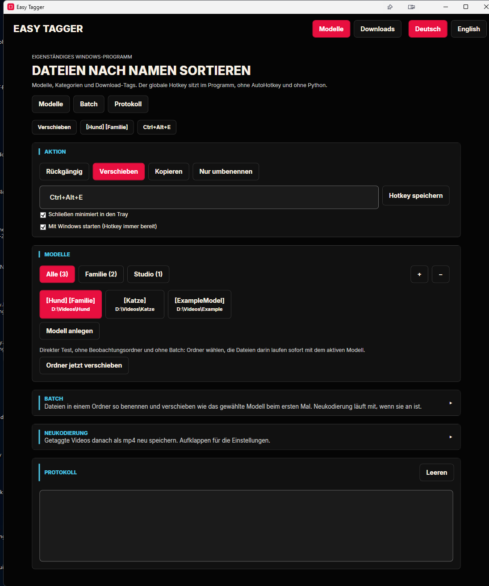
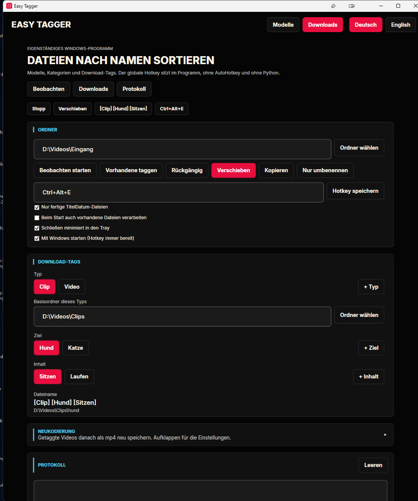

# Easy Tagger

Eigenständiges Windows-Programm zum Umbenennen und Verschieben von Videodateien. Es benutzt keine Python-Installation und kein AutoHotkey.

Die Oberfläche folgt dem dunklen Guide-Layout: schwarzer Grund, rote Abschnittsleiste, Chip-Buttons und ein goldener Rand für die aktive Auswahl.

## Start

Doppelklick auf `start.bat`. Dafür ist das .NET 8 SDK nötig. Die Konfiguration liegt unter `%LocalAppData%\EasyTagger\config.json`, nicht im Projektordner und nicht bei einem anderen Programm.

Standard-Hotkey: `Ctrl+Alt+E`. Er öffnet die Modell- oder Download-Auswahl, auch wenn das Fenster im Tray liegt. Schließen legt das Fenster in den Tray. Beenden geht über das Tray-Menü.

## Profile

**Modelle** weist einen Namen und einen Zielordner zu. Kategorien über `+` sortieren die Buttons. Der Haken „Auch im Dateinamen“ schreibt die Kategorie zusätzlich in den Namen. Ein `[]`-Tag, den du direkt in den Namen schreibst, bleibt beim Speichern erhalten.

**Downloads** setzt Typ, Ziel und Inhalt zu einem Namen zusammen, zum Beispiel `[Clip] [Hund] [Sitzen]`. Der Zielordner ist der Basisordner des Typs plus der Ordnername des Ziels.

## Beispiele

Die Bilder zeigen die mitgelieferten Beispielnamen Hund, Katze, Familie und Studio.

### Modelle

### Downloads

